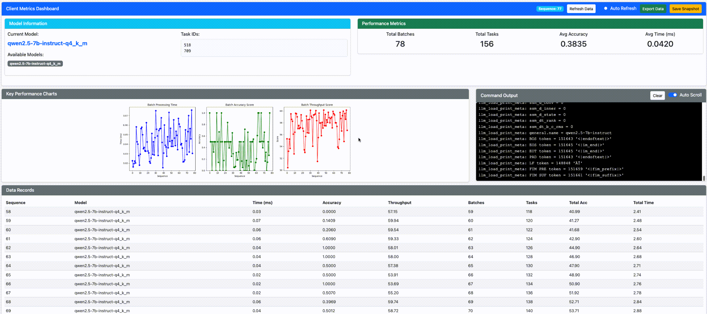

# LLM Distribution Center
-i https://pypi.tuna.tsinghua.edu.cn/simple
This document describes the code implementation of the center. The main steps include:

1. Establish the connection between edge nodes and the center, register all edge nodes and keep the connection alive throughout the process.
2. Retrieve input data from the local environment and generate inputs for each round.
3. Perform 20 task offloading rounds before the model offloading round.
4. After the algorithm finishes, match the target edge ID with task offloading decisions and model caching decisions.
5. Call the transmission function to distribute specific tasks to the edge nodes.
6. Call the function for model transmission.
7. Once the model deployment is ready, prepare for the next round.

## Sample Data Structure

*(maintainer: @wxhfj)*

* **task_id** :
  The primary key.
* **task_type** :
* **0 TC (Text Classification)**
  * *reference_enum* :
  * 0: sad
  * 1: happy
  * 2: love
  * 3: angry
  * 4: scared
  * 5: surprise
* **1 NER (Named Entity Recognition)**
  * *reference_enum* :
  * O: None
  * B-`<ENTITY>`: Beginning part of certain words
  * I-`<ENTITY>`: Internal part of certain words
  * *Entity* : PER (Person Name), LOC (Location), ORG (Organization), MISC (Miscellaneous)
* **2 QA (Question Answering)**
  * *reference_value* : ideal standard answer
* **3 TS (Translation Chinese to English)**
  * *reference_value* : ideal standard answer
* **4 SG (Summarization Generation)**
  * *reference_value* : ideal standard answer
* **task_token** :
  Query words.

# LLM model metrics

* **perplexity comparison** :

* **load time comparision** :

* **token process time comparision** :

* **UI** :

2025/05/14 updates:
add flask UI monitoring
* **Center**
’python common_tool/center_monitor.py‘

* **Edge**
'python common_tool/client_moniter.py'

* **terminal**

